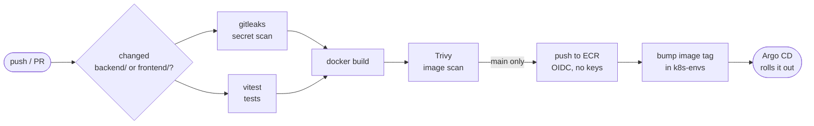

# Conduit: CI/CD and production changes

Fork of [TonyMckes/conduit-realworld-example-app](https://github.com/TonyMckes/conduit-realworld-example-app)
(React frontend, Node.js/Express API, PostgreSQL), prepared to run on AWS EKS. This repo holds the app code,
the Dockerfiles and the **CI pipeline**. The infrastructure and the overall architecture are described in the
[terraform repo](https://github.com/jelicki-jovan/terraform); what runs in the cluster is in
[k8s-envs](https://github.com/jelicki-jovan/k8s-envs).

## CI/CD pipeline



| Step | What | Fails the pipeline on |
|---|---|---|
| **Trigger** | `backend.yml` / `frontend.yml`, path filters: only the app that changed is built | – |
| **Secret scan** | gitleaks over the commits of the push / pull request | a committed secret |
| **Tests** | vitest for that app | a failing test |
| **Build** | Docker Buildx, multi-stage, layer cache in GitHub Actions | a build error |
| **Image scan** | Trivy on the built image | a **CRITICAL** vulnerability that has a fix |
| **Push** (main only) | image `hw-<app>-prod:<short commit SHA>` to ECR | – |
| **Deploy** (main only) | commits the new tag to `k8s-envs`; Argo CD syncs it | a rejected push after 5 retries |

- **Pull requests** run the checks (secret scan, tests, build, image scan) but never push or deploy. A newer
  push to the same PR cancels the running check.
- **One pipeline, two apps**: `app-ci.yml` is a reusable workflow with inputs `app` and `environment`;
  `backend.yml` and `frontend.yml` only add the triggers and the deploy job. A new app or environment is a
  few lines, not a copied pipeline.
- **Image tags are the commit SHA** and ECR tags are immutable: every running image maps to exactly one commit,
  and a tag can never be overwritten.
- **Deploy only after the push succeeded** (`needs: ci`): Argo CD never sees a tag whose image doesn't exist.
  Backend and frontend deploys are serialized, and a push rejected because the other app just deployed is
  rebased and retried.

### Access and supply-chain security

- **No AWS keys in GitHub**: the build job gets short-lived credentials through **GitHub OIDC**. The AWS role
  trusts only this repository's `main` branch (by its immutable repository ID), so pull requests, forks and
  other branches can't push images. The role ARN in the workflow isn't a secret; the trust policy protects it.
- **CI never talks to the cluster**: it only pushes an image and a Git commit. Argo CD pulls the change.
- **One secret**: `K8S_ENVS_DEPLOY_KEY`, an SSH deploy key with write access to `k8s-envs` only, used only by
  the deploy job on `main`. Not available to pull requests from forks.
- **Least privilege per job**: the workflow token is read-only; only the build job may request an OIDC token.
- **Third-party actions pinned to commit SHAs** (not tags, which can be moved to malicious code), with the
  version as a comment.

## Release process (suggestion for more environments)

Today there is one environment and every merge to `main` deploys straight to prod. With a dev environment
and a team, I'd keep the same **trunk-based** model (one long-lived branch, `main`) and add a reviewed step
before prod:

- **Protected `main`** (app and infrastructure repos): no direct or force pushes; changes only through short-lived
  branches and pull requests that need at least one approval, all checks passed (secret scan, tests, build,
  image scan) and the branch up to date. Changes to the CI workflows need a review from the platform team
  (CODEOWNERS).
- **Every merge to `main` builds the image once** and deploys it **automatically to dev** (the pipeline bumps
  the dev tag in `k8s-envs`, as it does for prod today).
- **Prod is a pull request in `k8s-envs`.** After the dev deploy, the pipeline copies the image **by digest**
  from the dev ECR repository to the prod one (no new build: prod runs exactly the bytes tested in dev) and
  opens a pull request that changes only the prod image tag. Merging it, with the required approval, is the
  release; Argo CD rolls it out. Every prod change is a reviewed Git commit, and a rollback is its revert.
- **Unfinished work** is merged behind feature flags, so `main` is always releasable.
- **Hotfix**: if the last release caused it, roll back first (revert the prod tag commit in `k8s-envs`);
  otherwise a normal small pull request into `main`, through dev and the same prod pull request. No separate
  hotfix branches and nothing to merge back.
- **Separate AWS roles per environment**: the CI role can push only to the dev repositories; copying into
  the prod repositories is a separate role, used only by the promotion step.
- More stages (e.g. staging) follow the same pattern: another folder in `terraform` and `k8s-envs`, and the
  same image promoted one step further (dev → staging → prod).

## Container images

| | Backend | Frontend |
|---|---|---|
| Base | `node:24-alpine` | build with Node, run on `nginx-unprivileged` (no Node.js in the image) |
| User | non-root (numeric UID), app files owned by root and read-only | non-root (uid 101), port 8080 |
| PID 1 | `tini` (forwards SIGTERM for graceful shutdown) | nginx |
| Removed | npm, npx, corepack (not needed at runtime, fewer vulnerabilities) | – |
| Extra | RDS CA bundle pinned by checksum, for verified TLS to the database | JSON access logs, `/api` proxied to the backend |

Both are built from the repo root (the npm workspace lockfile lives there):
`docker build -f backend/Dockerfile .`

## Changes to the app for production

Kept small; only what running it in Kubernetes on AWS required:

- **Health endpoints**: `/api/health/live` (process is up; never touches the database, so a short DB outage
  doesn't restart every pod) and `/api/health/ready` (database reachable; Kubernetes sends traffic only to ready pods).
- **Graceful shutdown**: on SIGTERM the backend fails readiness, finishes in-flight requests and closes the
  database pool before exiting.
- **Database migrations instead of `sequelize.sync()`**: the original app altered the schema on every pod
  start (races with several replicas). Replaced by one baseline migration matching the original schema,
  run once per deploy by a Kubernetes Job before the new pods start.
- **TLS to the database**, verified against the RDS certificate bundle.
- **IAM database authentication**: in production the backend logs in as a least-privilege `app_user` with a
  15-minute token signed with its pod's IAM role, so it has no database password at all
  (`PROD_DB_IAM_AUTH=true`; local development still uses a password).

---

*The original project's README follows.*

# 

> **React / Vite + SWC / Express.js / Sequelize / PostgreSQL codebase containing real world examples (CRUD, auth, advanced patterns, etc) that adheres to the [RealWorld](https://realworld.io/) spec and API.**

This codebase was created to demonstrate a fully fledged fullstack application built with **React / Vite + SWC / Express.js / Sequelize / PostgreSQL** including CRUD operations, authentication, routing, pagination, and more.

**[Demo app](https://conduit-realworld-example-app.fly.dev/)&nbsp;&nbsp;|&nbsp;&nbsp;[With Create React App](https://github.com/TonyMckes/conduit-realworld-example-app/tree/create-react-app)&nbsp;&nbsp;|&nbsp;&nbsp;[Other RealWorld Example Apps](https://codebase.show/projects/realworld?category=fullstack)**

> For more information on how to this works with other frontends/backends, head over to the [RealWorld](https://github.com/gothinkster/realworld) repo.

---

## Getting Started

These instructions will help you install and run the project on your local machine for development and testing.

### Prerequisites

Before you run the project, make sure that you have the following tools and software installed on your computer:

- Text editor/IDE (e.g., VS Code, Sublime Text, Atom)
- [Git](https://git-scm.com/downloads)
- [Node.js](https://nodejs.org/en/download/) `v18.11.0+`
- [NPM](https://www.npmjs.com/) (usually included with Node.js)
- SQL database

### Installation

To install the project on your computer, follow these steps:

1. Clone the repository to your local machine.

   ```bash
   git clone https://github.com/TonyMckes/conduit-realworld-example-app.git
   ```

2. Navigate to the project directory.

   ```bash
   cd conduit-realworld-example-app
   ```

3. Install project dependencies by running the command:

   ```bash
   npm install
   ```

### Configuration

1. Create a `.env` file in the root directory of the project
2. Add the required environment variables as specified in the [`.env.example`](backend/.env.example) file
3. (Optional) update the Sequelize configuration parameters in the [`config.js`](backend/config/config.js) file
4. If you are **not** using PostgreSQL, you may also have to install the driver for your database:

   <details>
   <summary>Use one of the following commands to install:</summary><br/>

   > Note: `-w backend` option is used to install it in the backend [`package.json`](backend/package.json).

   ```bash
   npm install -w backend pg pg-hstore  # Postgres (already installed)
   npm install -w backend mysql2
   npm install -w backend mariadb
   npm install -w backend sqlite3
   npm install -w backend tedious       # Microsoft SQL Server
   npm install -w backend oracledb      # Oracle Database
   ```

   > :information_source: Visit [Sequelize - Installing](https://sequelize.org/docs/v6/getting-started/#installing) for more infomation.

   ***

   </details>

5. Create database specified by configuration by executing

   > :warning: Please, make sure you have already created a superuser for your database.

   ```bash
   npm run sqlz -- db:create
   ```

   > :information_source: The command `npm run sqlz` is an alias for `npx -w backend sequelize-cli`.  
   > Execute `npm run sqlz -- --help` to see more of `sequelize-cli` commands availables.

6. Optionally you can run the following command to populate your database with some dummy data:

   ```bash
   npm run sqlz -- db:seed:all
   ```

### Usage

#### Development Server

To run the project, follow these steps:

1. Start the development server by executing the command:

   ```bash
   npm run dev
   ```

2. Open a web browser and navigate to:
   - Home page should be available at [`http://localhost:3000/`](http://localhost:3000).
   - API endpoints should be available at [`http://localhost:3001/api`](http://localhost:3001/api).

#### Running Tests

To run tests, simply run the following command:

```bash
npm run test
```

#### Production

The following command will build the production version of the app:

```bash
npm run start
```

## License

This project is licensed under the MIT License. See the [LICENSE](LICENSE) file for details.

## Acknowledgments

- [RealWorld](https://realworld.io/)
- [RealWorld (GitHub)](https://github.com/gothinkster/realworld)
- [CodebaseShow](https://codebase.show/)
- [How to write a Good readme](https://bulldogjob.com/news/449-how-to-write-a-good-readme-for-your-github-project)
