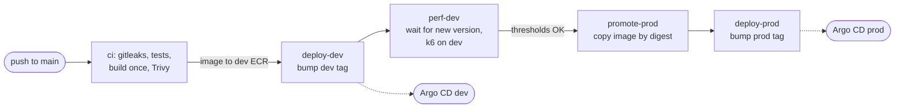

# Conduit: CI/CD and production changes

Fork of [TonyMckes/conduit-realworld-example-app](https://github.com/TonyMckes/conduit-realworld-example-app)
(React frontend, Node.js/Express API, PostgreSQL), prepared to run on AWS EKS. This repo holds the app code,
the Dockerfiles and the **CI pipeline**. The infrastructure and the overall architecture are described in the
[terraform repo](https://github.com/jelicki-jovan/terraform); what runs in the cluster is in
[k8s-envs](https://github.com/jelicki-jovan/k8s-envs).

## CI/CD pipeline

Trunk-based: `main` is the only long-lived branch. Every merge is **built once**, deployed to **dev**, checked
by a **performance regression test**, and then the **same image** (same digest) is promoted to **prod**.



| Job | What | Fails the pipeline on |
|---|---|---|
| **Trigger** | `backend.yml` / `frontend.yml`, path filters: only the app that changed runs | – |
| **ci** (reusable `app-ci.yml`) | gitleaks over the pushed commits, vitest, Docker build (multi-stage, layer cache), Trivy image scan, push `hw-<app>-dev:<short SHA>` to ECR (main only) | a secret, a failing test, a build error, a **CRITICAL** vulnerability with a fix |
| **deploy-dev** | commits the new tag to `k8s-envs` (`environments/dev/…`); Argo CD in the dev cluster rolls it out | a rejected push after 5 retries |
| **perf-dev** (reusable `perf.yml`) | waits until dev reports the new version, then the k6 performance test ([below](#performance-regression-test)) | a crossed threshold, or the version not live within 10 min |
| **promote-prod** (action `promote-image`) | copies the tested image from the dev to the prod ECR repository **without rebuilding** and checks both digests are identical | a digest mismatch |
| **deploy-prod** | commits the prod tag to `k8s-envs` (`environments/prod/…`); Argo CD in the prod cluster rolls it out | a rejected push after 5 retries |

- **Pull requests** run only `ci` (checks and build, no push, no deploy). A newer push to the same PR cancels
  the running check.
- **Build once, promote the same bytes**: prod never gets a rebuilt image; the digest check proves prod runs
  exactly what passed the tests and the performance gate on dev.
- **Each step waits for the previous one**: a failure anywhere stops the chain, and prod stays on the
  previous version.
- **Every image knows its version**: CI bakes the commit SHA in (`APP_VERSION` build arg); the backend returns
  it on `/api/health/live`, the frontend serves `/version.json`. That's how CI (which has no cluster access)
  knows when a rollout is finished, and how anyone can see what's running.
- **Reusable pieces**: `app-ci.yml` and `perf.yml` are reusable workflows, `deploy-k8s-envs` and
  `promote-image` composite actions; `backend.yml` and `frontend.yml` only wire them together. Another
  environment (e.g. staging) is a few lines, not a copied pipeline.
- **Image tags are the commit SHA** and ECR tags are immutable: every running image maps to exactly one
  commit. Backend and frontend may deploy at the same time; a rejected `k8s-envs` push is rebased and retried.

### Performance regression test

`perf/api.js` ([k6](https://k6.io/)) runs against **dev** after every dev deploy, before promotion:

- **Scenario**: 5 virtual users for 1 minute, mostly reads like real users of a blog: article list
  (anonymous and logged in), one article, tags, and a login in ~1 of 10 iterations. A dedicated test user and
  **100 seed articles** are created once (idempotent), so every run works on the same data volume.
- **Gate**: p95 per request type (article list < 500 ms, article and tags < 200 ms, login < 300 ms), errors
  < 1%, checks > 99%. The thresholds are about 2x the p95 measured in CI: normal noise passes, a 2-3x slowdown
  (e.g. a query without an index) fails and the image is not promoted. The summary is in the job summary.
- **What it answers**: "is the new version slower than the previous one?" on a small, stable dev environment.
  It is not a capacity test of prod; that needs a prod-sized environment (staging) and longer load tests.
- **Also runs on its own** (workflow **Perf**): on changes to `perf/**` and manually (*Run workflow*), testing
  what dev serves at that moment, without building or deploying anything.
- Next steps: store every run's results and compare against the median of recent runs (catches gradual
  slowdowns), trends in Grafana, longer load tests on a prod-sized staging.

### Access and supply-chain security

- **No AWS keys in GitHub**: the `ci` and `promote-prod` jobs get short-lived credentials through **GitHub
  OIDC**. The AWS role trusts only this repository's `main` branch (by its immutable repository ID), so pull
  requests, forks and other branches can't push images. The role ARN isn't a secret; the trust policy
  protects it.
- **CI never talks to the clusters**: it only pushes images and Git commits; Argo CD pulls the changes.
- **Two secrets**: `K8S_ENVS_DEPLOY_KEY` (SSH deploy key, write access to `k8s-envs` only, used by the deploy
  jobs) and `PERF_USER_PASSWORD` (the dev test user, passed explicitly to `perf.yml`). Neither is available
  to pull requests from forks.
- **Least privilege per job**: the workflow token is read-only; only the jobs that need AWS may request an
  OIDC token.
- **Third-party actions and the k6 image pinned** to commit SHAs / image digests (tags can be moved to
  malicious code), with the version as a comment.

## Release process: next steps

The pipeline above is **continuous deployment**: a change reaches prod automatically once it has passed all
automated gates. With a team, I'd add:

- **Protected `main`** (app and infrastructure repos): no direct or force pushes; changes only through
  short-lived branches and pull requests that need at least one approval, all checks passed and the branch up
  to date. Changes to the CI workflows need a review from the platform team (CODEOWNERS).
- **A human approval for prod, if required** (continuous delivery): instead of committing the prod tag,
  `deploy-prod` opens a **pull request in `k8s-envs`** that changes only the prod image tag. Merging it, with
  the required approval, is the release. Every prod change stays a reviewed Git commit.
- **Unfinished work** behind feature flags, so `main` is always releasable.
- **Hotfix**: if the last release caused it, roll back first (revert the prod tag commit in `k8s-envs`);
  otherwise a normal small pull request into `main`, through dev and the same gates. No separate hotfix
  branches and nothing to merge back.
- **Separate AWS roles**: today one CI role may push to both dev and prod repositories. Split into a build
  role (push to dev only) and a promotion role (pull from dev, push to prod), used only by `promote-prod`.
- More stages (e.g. staging for load tests) follow the same pattern: another folder in `terraform` and
  `k8s-envs`, another deploy + promote step, the same image promoted one step further.

## Container images

| | Backend | Frontend |
|---|---|---|
| Base | `node:24-alpine` | build with Node, run on `nginx-unprivileged` (no Node.js in the image) |
| User | non-root (numeric UID), app files owned by root and read-only | non-root (uid 101), port 8080 |
| PID 1 | `tini` (forwards SIGTERM for graceful shutdown) | nginx |
| Removed | npm, npx, corepack (not needed at runtime, fewer vulnerabilities) | – |
| Extra | RDS CA bundle pinned by checksum, for verified TLS to the database | JSON access logs, `/api` proxied to the backend |

Both are built from the repo root (the npm workspace lockfile lives there):
`docker build -f backend/Dockerfile .`

## Changes to the app for production

Kept small; only what running it in Kubernetes on AWS required:

- **Health endpoints**: `/api/health/live` (process is up, plus the running version; never touches the
  database, so a short DB outage doesn't restart every pod) and `/api/health/ready` (database reachable;
  Kubernetes sends traffic only to ready pods). The frontend serves its version on `/version.json`.
- **Graceful shutdown**: on SIGTERM the backend fails readiness, finishes in-flight requests and closes the
  database pool before exiting.
- **Database migrations instead of `sequelize.sync()`**: the original app altered the schema on every pod
  start (races with several replicas). Replaced by one baseline migration matching the original schema,
  run once per deploy by a Kubernetes Job before the new pods start.
- **TLS to the database**, verified against the RDS certificate bundle.
- **IAM database authentication**: in production the backend logs in as a least-privilege `app_user` with a
  15-minute token signed with its pod's IAM role, so it has no database password at all
  (`PROD_DB_IAM_AUTH=true`; local development still uses a password).

---

*The original project's README follows.*

# 

> **React / Vite + SWC / Express.js / Sequelize / PostgreSQL codebase containing real world examples (CRUD, auth, advanced patterns, etc) that adheres to the [RealWorld](https://realworld.io/) spec and API.**

This codebase was created to demonstrate a fully fledged fullstack application built with **React / Vite + SWC / Express.js / Sequelize / PostgreSQL** including CRUD operations, authentication, routing, pagination, and more.

**[Demo app](https://conduit-realworld-example-app.fly.dev/)&nbsp;&nbsp;|&nbsp;&nbsp;[With Create React App](https://github.com/TonyMckes/conduit-realworld-example-app/tree/create-react-app)&nbsp;&nbsp;|&nbsp;&nbsp;[Other RealWorld Example Apps](https://codebase.show/projects/realworld?category=fullstack)**

> For more information on how to this works with other frontends/backends, head over to the [RealWorld](https://github.com/gothinkster/realworld) repo.

---

## Getting Started

These instructions will help you install and run the project on your local machine for development and testing.

### Prerequisites

Before you run the project, make sure that you have the following tools and software installed on your computer:

- Text editor/IDE (e.g., VS Code, Sublime Text, Atom)
- [Git](https://git-scm.com/downloads)
- [Node.js](https://nodejs.org/en/download/) `v18.11.0+`
- [NPM](https://www.npmjs.com/) (usually included with Node.js)
- SQL database

### Installation

To install the project on your computer, follow these steps:

1. Clone the repository to your local machine.

   ```bash
   git clone https://github.com/TonyMckes/conduit-realworld-example-app.git
   ```

2. Navigate to the project directory.

   ```bash
   cd conduit-realworld-example-app
   ```

3. Install project dependencies by running the command:

   ```bash
   npm install
   ```

### Configuration

1. Create a `.env` file in the root directory of the project
2. Add the required environment variables as specified in the [`.env.example`](backend/.env.example) file
3. (Optional) update the Sequelize configuration parameters in the [`config.js`](backend/config/config.js) file
4. If you are **not** using PostgreSQL, you may also have to install the driver for your database:

   <details>
   <summary>Use one of the following commands to install:</summary><br/>

   > Note: `-w backend` option is used to install it in the backend [`package.json`](backend/package.json).

   ```bash
   npm install -w backend pg pg-hstore  # Postgres (already installed)
   npm install -w backend mysql2
   npm install -w backend mariadb
   npm install -w backend sqlite3
   npm install -w backend tedious       # Microsoft SQL Server
   npm install -w backend oracledb      # Oracle Database
   ```

   > :information_source: Visit [Sequelize - Installing](https://sequelize.org/docs/v6/getting-started/#installing) for more infomation.

   ***

   </details>

5. Create database specified by configuration by executing

   > :warning: Please, make sure you have already created a superuser for your database.

   ```bash
   npm run sqlz -- db:create
   ```

   > :information_source: The command `npm run sqlz` is an alias for `npx -w backend sequelize-cli`.  
   > Execute `npm run sqlz -- --help` to see more of `sequelize-cli` commands availables.

6. Optionally you can run the following command to populate your database with some dummy data:

   ```bash
   npm run sqlz -- db:seed:all
   ```

### Usage

#### Development Server

To run the project, follow these steps:

1. Start the development server by executing the command:

   ```bash
   npm run dev
   ```

2. Open a web browser and navigate to:
   - Home page should be available at [`http://localhost:3000/`](http://localhost:3000).
   - API endpoints should be available at [`http://localhost:3001/api`](http://localhost:3001/api).

#### Running Tests

To run tests, simply run the following command:

```bash
npm run test
```

#### Production

The following command will build the production version of the app:

```bash
npm run start
```

## License

This project is licensed under the MIT License. See the [LICENSE](LICENSE) file for details.

## Acknowledgments

- [RealWorld](https://realworld.io/)
- [RealWorld (GitHub)](https://github.com/gothinkster/realworld)
- [CodebaseShow](https://codebase.show/)
- [How to write a Good readme](https://bulldogjob.com/news/449-how-to-write-a-good-readme-for-your-github-project)
